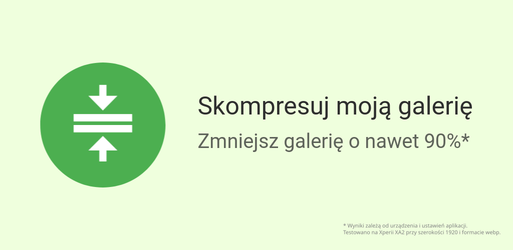
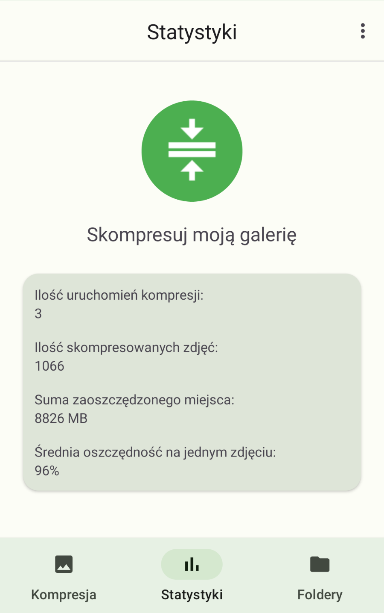
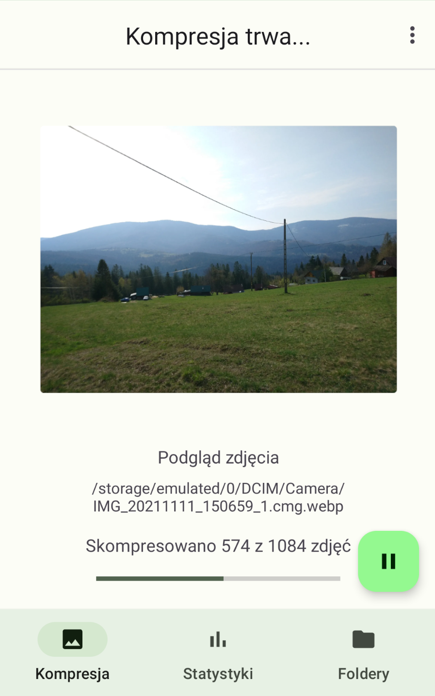
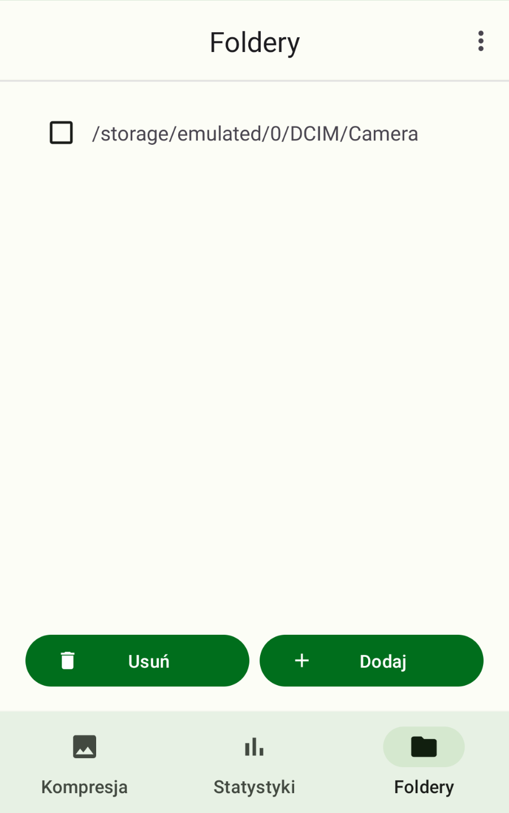
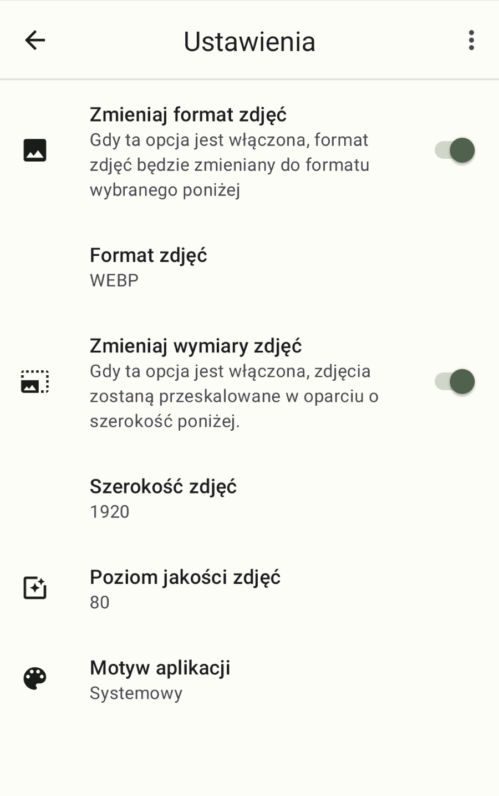
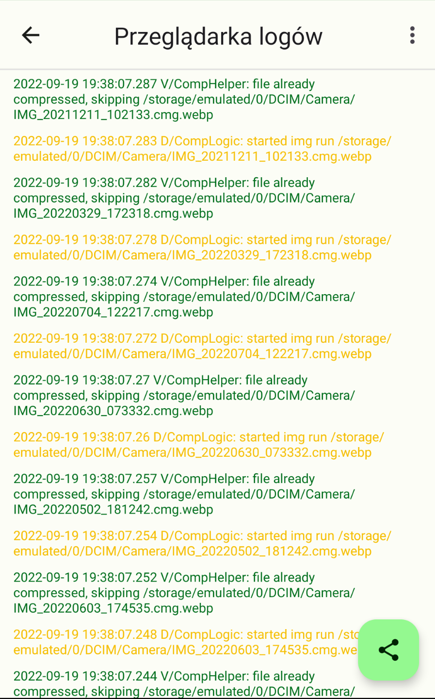

# Opis
Aplikacja do kompresji zdjęć lub zdjęć w folderach.

Dzięki niej byłem wstanie zaoszczędzić około 10 GB miejsca na moim telefonie.

W zależności od tego jak bardzo twoje urządzenie kompresuje zdjęcia obecnie, ta aplikacja może zmniejszyć rozmiar zdjęć na twoim telefonie nawet kilkukrotnie bez dużych różnic w jakości.

W przypadku dobrania odpowiednich ustawień możliwe jest zmniejszenie zdjęcia o wielkości 10 MB do kilkuset kilobajtów, bez znacznych różnic w jakości.

Jest to bardzo przydatne jeśli przechowuje się na telefonie dużo zdjęć prostych zdjęć takich jak np. paragony.

Domyślne ustawienia są zoptymalizowane pod jakość.

Aby dowiedzieć się jakie ustawienia trzeba wybrać aby zoptymalizować rozmiar zdjęć, trzeba kliknąć w przycisk "Obsługa" wewnątrz aplikacji.

# Uwaga
Aplikacja jest we wczesnej fazie rozwoju.

Przed jej użyciem zalecane jest wykonanie odpowienich kopii zapasowych.

Niniejszy program jest rozpowszechniany z nadzieją, iż będzie on użyteczny - jednak BEZ ŻADNEJ GWARANCJI.

# Zrzuty ekranów
### Ekran statystyk

### Ekran kompresji

### Ekran folderów

### Ekran ustawień

### Ekran logów

