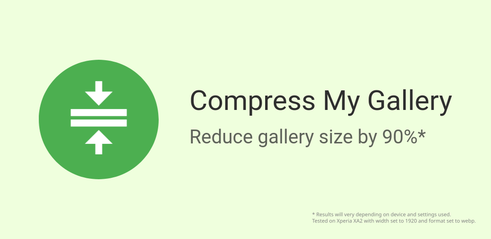
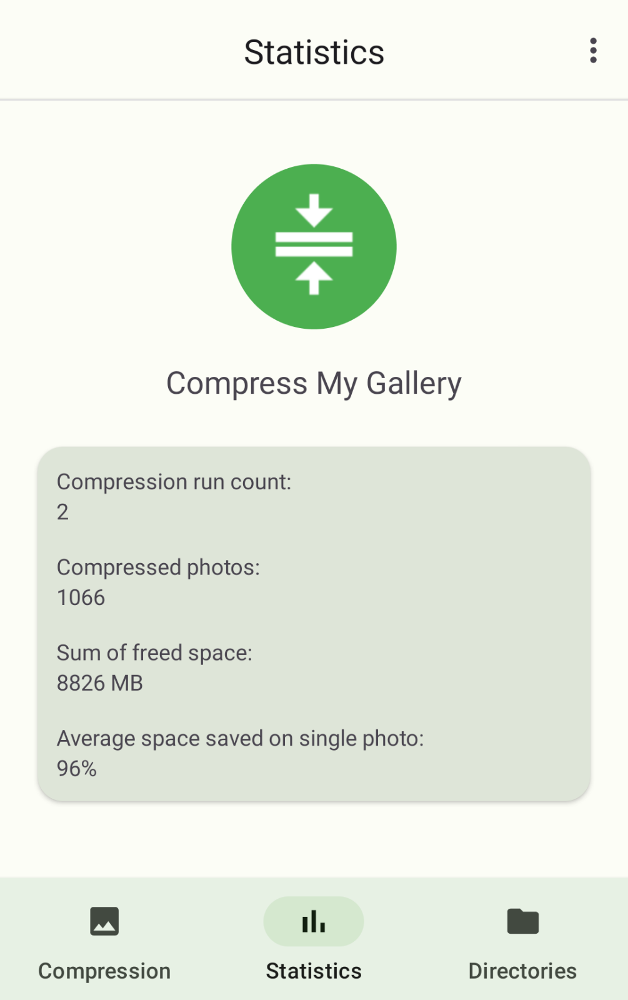
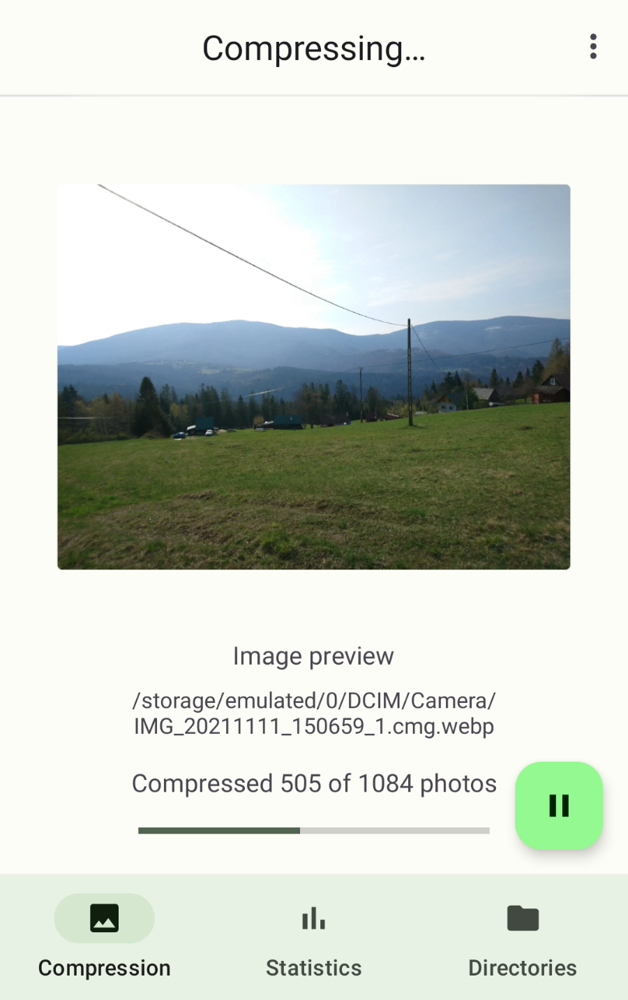
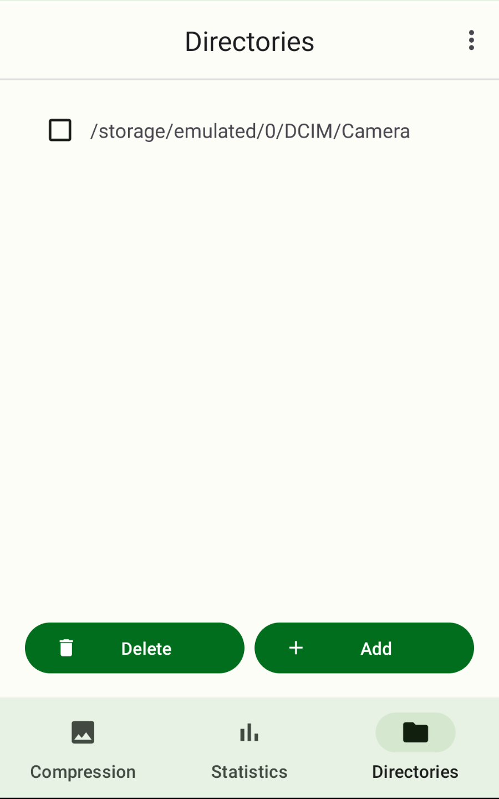
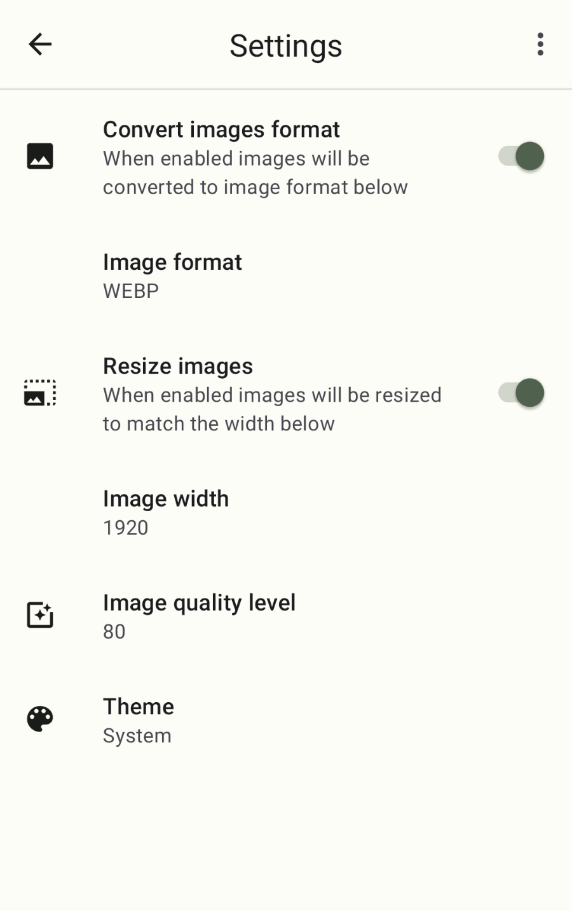
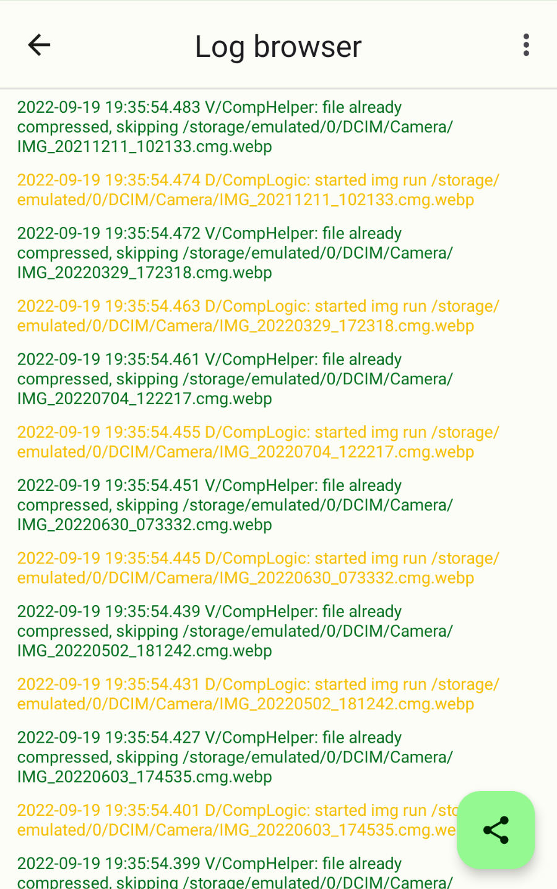

# Description
This app can be used for compressing photos or photos in directories.

With this app I've been able to save a about 10 GB of space on my phone.

Depending on how much your device compresses photos already, it can reduce the size of photos even multiple times without noticeable difference in quality.

If right settings are chosen it can shrink 10 MB photos to few hundred kilobytes, without big differences in quality.

Very useful if you have many photos of simple things like reciepts.

Default settings are optimized for quality.

Information on how to change the settings to minimize photo size, can be found after pressing "Usage" button in the app.

# Warning
This app is in development.

Though in my testing it didn't damage any photos I still advise to make appropriate backup copies of data on your device before using it, since the app overwrites files when compressing.

It is is distributed in the hope that it will be useful, but WITHOUT ANY WARRANTY.

# Screenshots
### Statistics screen

### Compression screen

### Directory screen

### Settings screen

### Log screen

